# CI/CD with Jenkins Guide

###### Prepared by Nguyen Duy Cuong

###### Viettel IDC

###### 27/04/2021

---

#### Table of Contents

[1. Introduction](#1)

[2. Install Docker](#2)

[3. Downloading and running Jenkins in Docker](#3)

[4. Downloading and running GitLab in Docker](#4)

[5. Build Project and Deploy to host](#5)

## 1. Introduction<a name="1"></a>

###### 1.1 CI/CD 

​	Là một bộ đôi công việc, bao gồm CI (Continuous Integration) và CD (Continuous Delivery),  là quá trình tích hợp (integration) thường xuyên, nhanh chóng hơn khi code cũng như thường xuyên cập nhật phiên bản mới (delivery). 

​	Trong quá trình tích hợp (integration) liên tục, mỗi khi developer hợp nhất các thay đổi code của mình vào project, một chuỗi các thử nghiệm được kích hoạt. Điều này giúp họ xác định lỗi ngay lập tức. Khi một commit không có lỗi, thì CI sẽ cập nhật (delivery) commit đó. Thông thường, quá trình này đòi hỏi sự can thiệp thủ công. Nhưng với các công cụ CI/CD, toàn bộ quá trình kiểm tra đó có thể được tự động hóa cho tới bước release. Mỗi hợp nhất mã mới được tự động kiểm tra và các commit này được đẩy để triển khai hay release cho khách hàng.

​	CI/CD giúp cung cấp các framework, workflow giúp tiết kiệm thời gian, nguồn lực của quá trình release (delivery).

Các công cụ CI/CD phổ biến như Jenkins, GitLab CI/CD tools, TeamCity, v.v.

###### 1.2 Jenkins 

​	Là một máy chủ tự động hóa mã nguồn mở khép kín có thể được sử dụng để tự động hóa tất cả các loại nhiệm vụ liên quan đến xây dựng, thử nghiệm và phân phối hoặc triển khai phần mềm.

​	Jenkins có thể được cài đặt thông qua các gói hệ thống gốc, Docker hoặc chạy độc lập bởi bất kỳ máy nào có cài đặt Java Runtime Environment (JRE).

​	Jenkins là một sản phẩm có khả năng mở rộng cao mà chức năng của nó có thể được mở rộng thông qua việc cài đặt các plugin. Có rất nhiều plugin có sẵn cho Jenkins.

###### 1.3 Docker 

​	Là một nền tảng để chạy các ứng dụng trong một môi trường biệt lập được gọi là container. Các ứng dụng như Jenkins có thể được tải xuống dưới dạng read-only images, mỗi ứng dụng được chạy trong Docker dưới dạng một container. Một Docker container trên thực tế là một "phiên bản đang chạy"(running instance) của Docker images. Trong các container, ứng dụng chạy trên hệ điều hành bất kì mà nó có thể hoạt động được - Docker cung cấp mọi môi trường phù hợp cho ứng dụng.

Quy trình cài đặt hệ thống CI/CD:

- Cài đặt Docker

- Cài đặt 2 ứng dụng GitLab và Jenkins (Blue Ocean) trên 2 Docker container riêng biệt

- 

Mô hình CI/CD:


## 2. Install Docker<a name="2"></a>

*Lưu ý: có thể sử dụng command `yum update -y` để cập nhật phiên bản mới nhất của các package, service đã có*

Docker version: 19.03.13

Các package yêu cầu: 

- yum-utils: các công cụ và chương trình để quản lý yum repositories, cài đặt debug packages, source packages.
- docker-ce, docker-ce-cli, containerd.io: các package docker.

Command:

```
# yum install -y yum-utils
# yum-config-manager --add-repo https://download.docker.com/linux/centos/docker-ce.repo
# yum install docker-ce-19.03.13 docker-ce-cli-19.03.13 containerd.io -y
# systemctl start docker
```

Output:

- Install yum-utils:

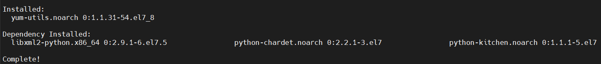

- Get repositories docker:

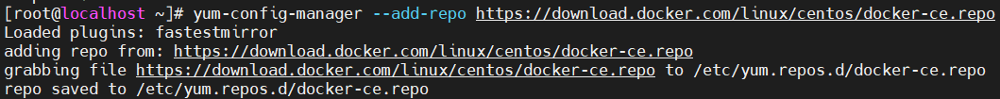

- Install docker:

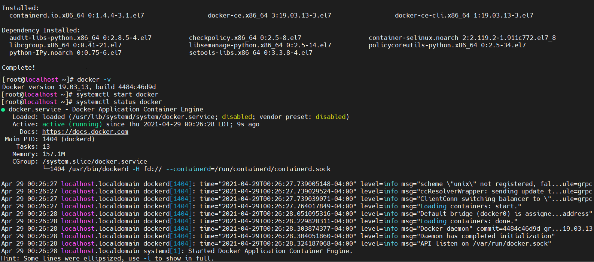

## 3. Downloading and running Jenkins in Docker<a name="3"></a>

Tạo bridge network: `docker network create jenkins` 

 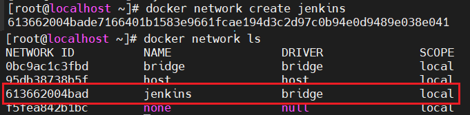

Pull image jenkins và khởi chạy container:

```
docker run \
  --name jenkins-docker \
  --rm \
  --detach \
  --privileged \
  --network jenkins \
  --network-alias docker \
  --env DOCKER_TLS_CERTDIR=/certs \
  --volume jenkins-docker-certs:/certs/client \
  --volume jenkins-data:/var/jenkins_home \
  --publish 2376:2376 \
  docker:dind \
  --storage-driver overlay2
```

 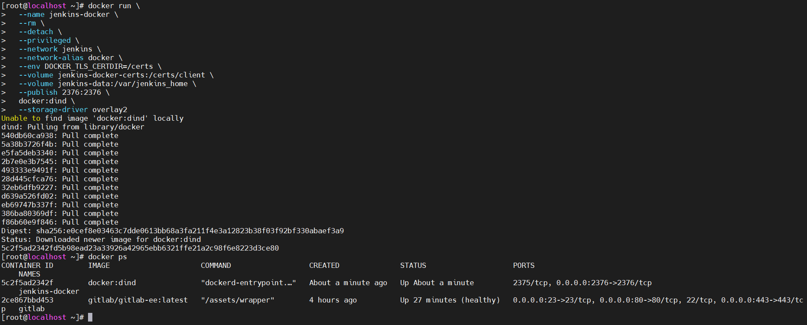

Tạo Dockerfile để build image Jenkins BlueOcean, script:

```
FROM jenkins/jenkins:2.277.2-lts-jdk11
USER root
RUN apt-get update && apt-get install -y apt-transport-https \
       ca-certificates curl gnupg2 \
       software-properties-common
RUN curl -fsSL https://download.docker.com/linux/debian/gpg | apt-key add -
RUN apt-key fingerprint 0EBFCD88
RUN add-apt-repository \
       "deb [arch=amd64] https://download.docker.com/linux/debian \
       $(lsb_release -cs) stable"
RUN apt-get update && apt-get install -y docker-ce-cli
USER jenkins
RUN jenkins-plugin-cli --plugins "blueocean:1.24.6 docker-workflow:1.26"
```

 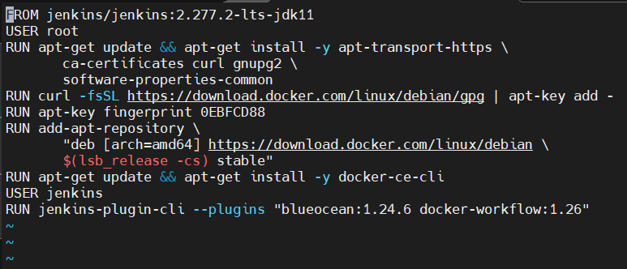

Build image Jenkins BlueOcean: `docker build -t myjenkins-blueocean:1.1 .`

 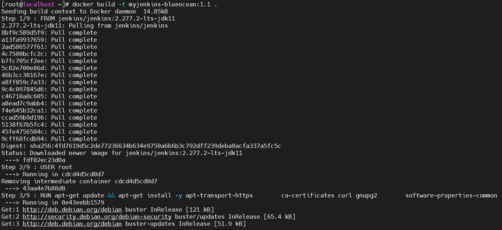

Chạy container Jenkins BlueOcean:

```
docker run \
  --name jenkins-blueocean \
  --rm \
  --detach \
  --network jenkins \
  --env DOCKER_HOST=tcp://docker:2376 \
  --env DOCKER_CERT_PATH=/certs/client \
  --env DOCKER_TLS_VERIFY=1 \
  --publish 8080:8080 \
  --publish 50000:50000 \
  --volume jenkins-data:/var/jenkins_home \
  --volume jenkins-docker-certs:/certs/client:ro \
  myjenkins-blueocean:1.1 
```


## 4.Downloading and running GitLab in Docker<a name="4"></a>

- Disable SELINUX:
  - Command: `Vi /etc/selinux/config`
  - Thay đổi thuộc tính SELINUX thành disabled

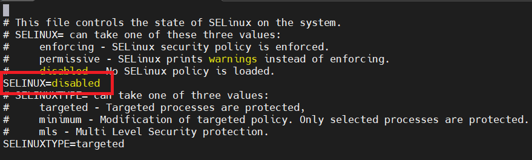

- Output:

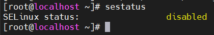

> ​	Trước khi cài đặt, cần chỉ định vị trí thư mục chứa các file configuration, logs, và data(phải đảm bảo rằng thư mục này tồn tại và được cấp quyền phù hợp. GitLab sử dụng các phân vùng ổ cứng trên máy chủ (local host) Docker để lưu trữ các file trên, cụ thể:

| Local location        | Container location | Usage                 |
| :-------------------- | :----------------- | :-------------------- |
| `$GITLAB_HOME/data`   | `/var/opt/gitlab`  | Lưu trữ dữ liệu       |
| `$GITLAB_HOME/logs`   | `/var/log/gitlab`  | Lưu trữ log           |
| `$GITLAB_HOME/config` | `/etc/gitlab`      | Lưu trữ file cấu hình |

Command:

```
# export GITLAB_HOME=/srv/gitlab
# sudo docker run --detach \
  --hostname gitlab.example.com \
  --publish 443:443 --publish 80:80 --publish 23:23 \
  --name gitlab \
  --restart always \
  --volume $GITLAB_HOME/config:/etc/gitlab \
  --volume $GITLAB_HOME/logs:/var/log/gitlab \
  --volume $GITLAB_HOME/data:/var/opt/gitlab \
  gitlab/gitlab-ee:latest
```

> ​	Sau khi chạy command trên, Docker sẽ pull image phiên bản mới nhất của GitLab và khởi chạy với hostname "gitlab.example.com" và truyền dữ liệu qua các port 443(https), 80(http), và 23(ssh) thông qua các port tương ứng của máy chủ Docker.

Output:

- Pull image

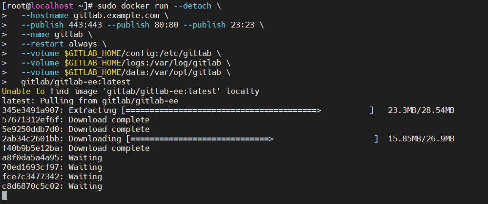

- Success

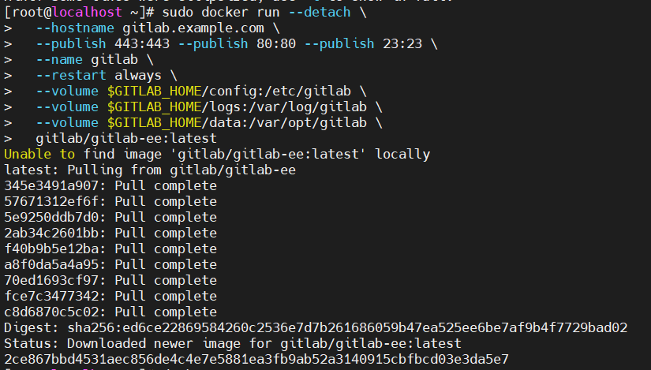

- Kiểm tra trạng thái container với command `docker ps`:

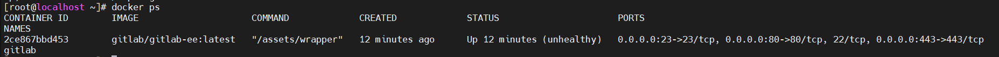

## 5. Build Project and Deploy to host <a name="5"></a>

// 